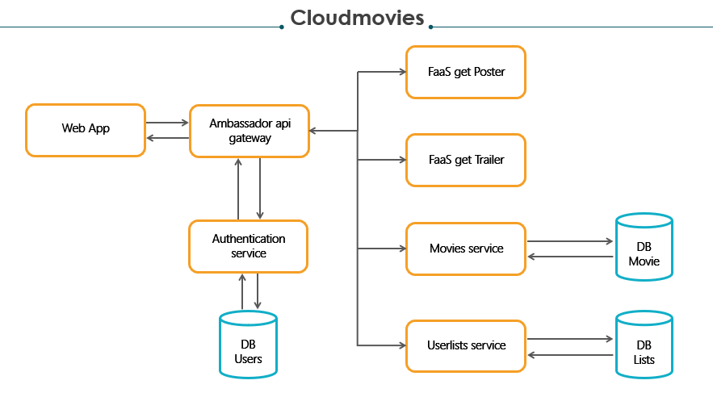

# CloudMovies

CloudMovies - A simple application to search movies info and posters, based on a microservices architecture.

## The application

In this section are described the basic informations about each microservices of the application and the prerequisites and the instruction to run it.

### Architecture

* Ambassador is the API gateway: it receives and forwards all the http requests directed to the backend microservices
* Authentication service is responsible for validate the requests before the gateway forwards them to a protected microservice
* Movies service exposes API useful to get movies information or search movies by title or genre
* Favorites service exposes CRUD API for managing favorite movies' lists
* Faas getPoster exposes an API useful to obtain the URL of the poster of a movie
* WebApp is the service which run the frontend website

### Prerequisites

This application requires a running Kubernetes cluster wiht Openfaas installed as described [here](https://docs.openfaas.com/deployment/kubernetes/).
This application was developed and tested on a Debian 10.2 Azure Lab Virtual Machine with Kubernetes v1.16.2, minikube v1.5.2 and Docker 19.03.4.

### Installing

These steps have to be followed in order to launch and use the application

* Clone this repository on your machine
* Create the folders /data/favoritesdb, /data/userdb, /data/moviedb for persistent storage of DBs
* Create a the file tmdb_api_key.txt containing your TMDB apikey and move it in the root project folder
* From root project folder execute the file setup.sh
* Now the application should be deployed: at http://localhost:8080 is avaiable the web application; at http://localhost:8088 you can make http request directly to the API gateway

## Built With

* [Kubernetes](https://kubernetes.io/)
* [Docker](https://www.docker.com/)
* [Flask](https://www.palletsprojects.com/p/flask/)
* [MySQL](https://www.mysql.com/)
* [NGINX](https://www.nginx.com/)

## Authors
* Roberto Tagliabue 807409
* Andrea Vegetti 794298
* Haixing Chen 793027

## License

This project is licensed under the GNU General Public License v3.0 License - see the [LICENSE.md](LICENSE.md) file for details